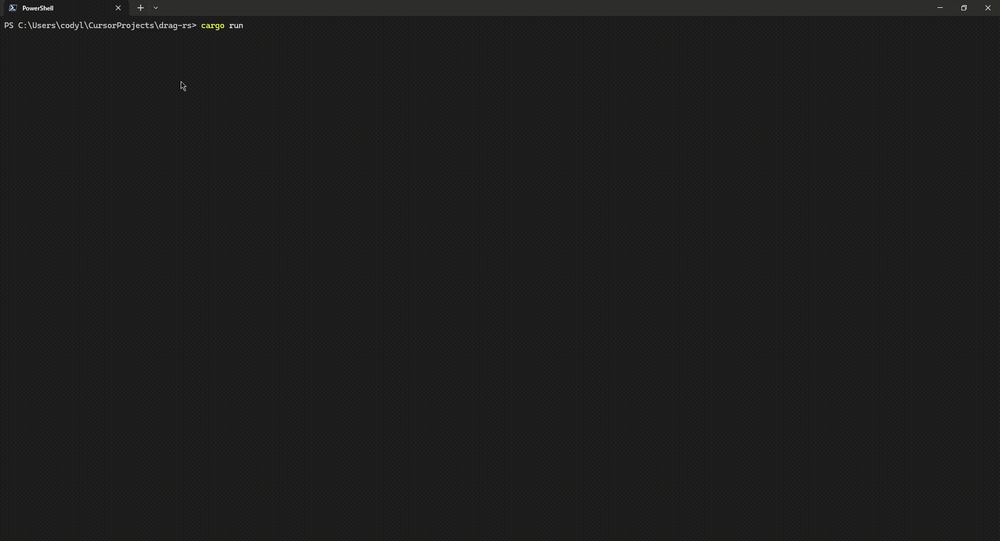

# drag-rs

A high-octane terminal-based drag racing game built with Rust and Ratatui.



## Features

- **Timing-based gameplay** - Perfect your reaction time and shifting
- **Car customization** - Choose from different car models with unique stats
- **AI opponents** - Race against intelligent computer opponents
- **Christmas tree start** - Authentic drag racing starting sequence
- **Real-time physics** - Realistic acceleration, RPM, and shifting mechanics
- **Immersive audio** - Engine sounds, Christmas tree beeps, and red light warnings
- **Beautiful terminal UI** - Clean, colorful interface with Ratatui

## Controls

- `SPACE` - Throttle (Hold/Release)
- `↑` or `W` - Shift up
- `N` - Nitrous (Hold/Release)
- `M` - Toggle audio mute
- `ESC` - Return to menu
- `Q` - Quit game

## Installation

```bash
git clone https://github.com/Cod-e-Codes/drag-rs.git
cd drag-rs
cargo run
```

## Gameplay

1. Select your car from the menu
2. Wait for the green light on the Christmas tree
3. Launch with perfect timing to avoid red lights
4. Shift at the optimal RPM for maximum acceleration
5. Use nitrous strategically to gain an edge
6. Cross the finish line first!

## Audio Features

The game includes immersive audio that enhances the racing experience:

- **Engine Sounds** - Realistic engine audio that changes with RPM and throttle
  - Higher RPM = higher pitch engine sound
  - Throttle position affects volume
  - Idle sound when not accelerating
- **Christmas Tree Beeps** - Audio cues for the starting sequence
  - Yellow lights: 800Hz beep
  - Green light: 1200Hz beep (higher pitch for excitement)
  - Red light: 400Hz warning beep (lower pitch)
- **Mute Functionality** - Press `M` at any time to toggle audio on/off
  - Audio status is shown in the main menu
  - Mute state persists across game sessions

## Development

Built with:
- **Rust** - Systems programming language
- **Ratatui** - Terminal UI framework
- **Crossterm** - Cross-platform terminal manipulation
- **CPAL** - Cross-platform audio library for real-time audio synthesis

## License

MIT License
